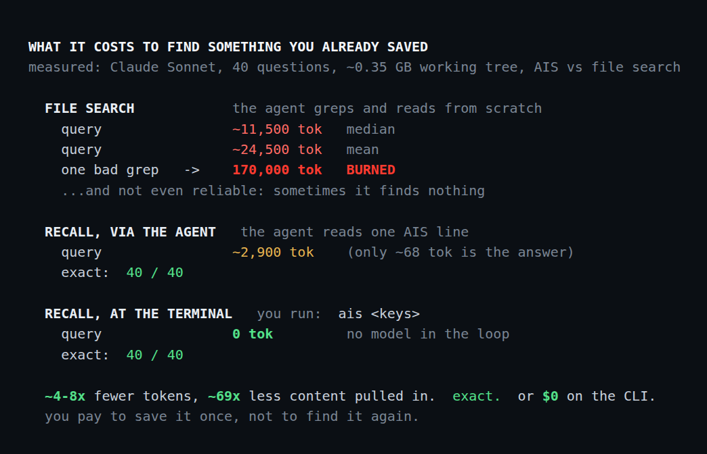
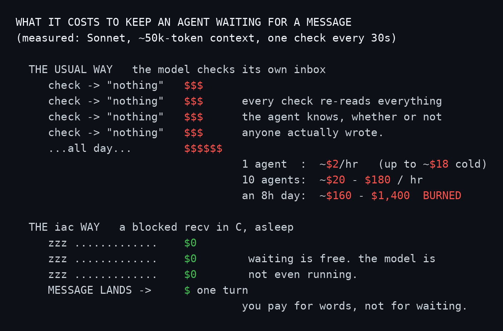

# Recipes for working with coding agents

Practices for driving coding agents. Each carries a one-line lead, the payload:
**Say:** is what you tell the agent, **Do:** is a practice you follow yourself.
The paragraph under it is why.

Each recipe is a policy over a state, a goal, and a verifier. The state is the
directory: the files are all the agent sees, so keep one concept per directory and
each stays small and whole (you rarely name a target, the directory scopes one).
The goal is the prompt. The verifier is the test or harness that says it got
there, the part most people forget. The directory is also the channel and the
agent's only durable memory: whatever it needs that lives in your head or the chat
is invisible, and gone the next session, so keep the state, the intent, and the
check in the files.

Some recipes are close to universal (test every feature, keep docs true); others
are the author's choices for specific projects (plain C, SQL to JSON, plain
builds). None are offered as absolutes: they are tips, take what fits your stack
and drop what does not. Most are tool-agnostic; two lean on small tools the author
wrote, [iac](https://github.com/Anode1/iac) (inter-agent messaging) and
[ais](https://github.com/Anode1/ais) (associative memory). Some recipes link to a
cost model or paper.

## Foundations

### 1. Test every feature, UI included

**Do:** build a screenshot harness (CDP for web, Xvfb for native GUI), then a test per feature on it.

Every feature ships with a test the agent runs itself: a test is a checkable
target it iterates against without you in the loop (what "done" means is *Done is
code, then doc, then test*, next). UI is not exempt, and the highest-leverage
thing you can build is a screenshot harness that makes the screen testable
headlessly: a headless browser (CDP) for a web UI, a virtual display (Xvfb) for a
native GUI. With it the agent brings up the app, auths and seeds the data it
needs, renders, captures the PNG, reads it back, asserts the expected state, and
tears down, in CI like any other test. Non-UI code is easier: a suite the agent
runs itself (`make ut` + ASan/UBSan in C, `ant` in Java, run in CI). Build the
harness once and every later feature, UI or not, has a way to prove itself.

### 2. Done is code, then doc, then test

**Say:** "code, then the doc, then a test that replays it"

Code is ground truth: on any conflict, code wins. An endpoint is not done when it
runs; it is done in three steps, in order:

1. Write the code, the ground truth.
2. Write the doc to match, in the same change. Prose is the agent's cheapest
   context, far fewer tokens than code, but only while true: a stale doc is worse
   than none, the agent builds to it and its gaps leak into the code.
3. Replicate the endpoint as an integration test (it runs through the live
   server) that asserts the intended response, not a snapshot of the current one,
   so the behavior is pinned and the doc has a check.

Write docs an agent can act on: for an API, a compact reference plus a parallel
examples file, same order, updated together, so the examples are the spec the
test is written from. See [`examples/RESTapi.txt`](examples/RESTapi.txt) (the
reference) and [`examples/RESTapi-examples.txt`](examples/RESTapi-examples.txt)
(matching request and response examples).

### 3. Fresh session beats a compacted one

**Do:** start a fresh session once the agent begins compacting.

The context window is working memory, not storage. Once the window is long or
compacted, the detail you need may be gone or buried, and quality can drop. Start
fresh: the project's real state lives in its docs (*Done is code, then doc, then
test*) and its ais index (*Recall, don't re-derive*), so a new session
reconstitutes by recall, cheap and complete, not by replaying the whole history.
Keep the window short.

## Tools

### 4. Recall, don't re-derive

**Say:** "recall with `ais <keys>`, store with `ais <keys> -v <value>`"

Stop re-explaining the same steps each session. Store once, recall by key.
Re-searching the project burns thousands of tokens; recall is a handful, the query
itself is ~free, and the cost scales only with what you stored.

[*Compress the Access*](https://doi.org/10.5281/zenodo.20764255)

Wire it into the agent as a skill: [`examples/ais.SKILL.md`](examples/ais.SKILL.md) teaches the agent to operate ais (recall before re-deriving, store what it worked out). It teaches the mechanism, not any keys or values, those are yours to choose.

### 5. Coordinate, don't poll

**Say:** "wait on `iac recv <room> <you>`"

Several agents on one box: one shared channel, not N pollers. Each parks a
blocking `recv` and wakes when a message lands. A parked `recv` costs no inference
while it waits; a model polling its own inbox pays an inference per check.

[*A Wakeup, Not a Broker*](https://doi.org/10.5281/zenodo.21206970)

Wire it into the agent as a skill: [`examples/iac.SKILL.md`](examples/iac.SKILL.md) teaches the agent to wait on `iac recv` instead of polling.

## The principle

### 6. Plain code, no frameworks

**Say:** "plain C, no frameworks"

Frameworks and syntactic sugar exist to help *people* manage complexity. When an
agent writes the code they mostly cost: more surface to audit, more context to
hold, more ways to be wrong, for little you gain. C++ piles on overloads,
templates, and implicit conversions, ambiguity you then have to verify. Default to
no framework; reach for one only when it plainly earns its keep. If the agent
writes it and you can read plain C, prefer plain C: less to hold in context, fewer
failure modes, cheaper to verify.

(In practice the author reaches for the most natural language per domain: Java for
web apps, C for systems and native code, SQL for relational-algebra engines, and
plain text for data, auditable and universally readable. Natural fits, not
framework layers.)

## House style

The author's stack choices, one instance of *Plain code, no frameworks*, not
prescriptions.

### 7. Thin backend: SQL to JSON, no layers between

**Say:** "return JSON straight from the query, one connection per request"

For a full-stack app, drop the object layers between the database and the wire. No
POJOs, no ORM, no DTO mapping: hand-written SQL returns the rows, and the
row-to-JSON transform streams to the response as the result set is read, never
materialized as an object graph first. Every request value is a bound parameter
(`PreparedStatement`), never concatenated into the SQL. One user action is one
connection (borrowed from the pool) and one query where it can be: a single JOIN
over a query-per-row loop, one bulk insert over insert-in-a-loop, an explicit
transaction only when one action must commit several writes together. Streaming
ties the connection to the client's speed and cannot change the status code after
the first byte, so bound the result size. SQL is the native language for
relational algebra; an ORM is a layer over it (*Plain code, no frameworks*) that
for an agent is mostly cost. Fewer layers: fewer tokens to hold, fewer places to
be wrong.

### 8. MISRA-style C: stack-first, bounded, no heap

**Say:** "stack-first, no heap, bounded buffers"

When the agent writes C, hold it to the avionics and medical-device standard and
you sharply reduce most of C's memory-safety CVE classes. Process one record at a
time in automatic (stack) variables and fixed-size buffers; for streamable,
single-pass work peak memory is a function of the struct sizes, not the data size,
so a 10 GB input and a 10 KB input run in the same footprint (genuinely
data-proportional work uses a bounded static pool, not the heap). Avoid the heap;
when it is truly unavoidable the allocation is bounded, documented, and freed on
every path. Bounded strings only (`snprintf`, and check its return for truncation;
never `strcpy`/`strcat`/`sprintf`). Single exit when a function holds a resource: a
single guarded return, or the `goto cleanup` kernel idiom (a strict MISRA reading
forbids `goto`, so prefer the guarded return if you follow it to the letter).
Return codes, not `exit()`, inside the modules. Build clean under
`-std=c99 -Wall -Wextra` (a warning is a defect; `-Werror` in CI) and run the
suite under AddressSanitizer/UBSan. This is NASA's Power of Ten (rule 3, no heap
after init) and MISRA C:2012 rule 21.3 (no `malloc`/`free`), the discipline that
lets the code run unattended.

Full rules: ais's [`STYLE.md`](https://github.com/Anode1/ais/blob/main/doc/dev/STYLE.md).

### 9. Plain build: Makefile or Ant, nothing generated

**Say:** "plain Makefile for C, ant for Java, no autotools, no Maven"

A build should be readable in one file, not generated by another tool. For a
single-target project with few dependencies, a plain `Makefile` and `cc` are
enough for native code (no autotools, no CMake, nothing that writes your build for
you), and an `ant` file is enough for Java (no Maven, no Gradle, jars vendored in
the repo). The heavier tools (CMake, Maven, Gradle, autotools) earn their keep
once you have multiple platforms or a real transitive dependency graph to resolve;
short of that they are a dependency you install and version-sync for a problem you
do not have. The build is also a file the agent reads and edits, so keep it small,
explicit, and offline: a stock toolchain (GNU make, or ant) builds the project
unchanged, with no generated layer between the command and the compiler (*Plain
code, no frameworks*).

Templates: [`examples/build.xml`](examples/build.xml) (Java web app: compile, jar
with a version-stamped manifest, war, run, test) and
[`examples/Makefile`](examples/Makefile) (C: build, test, sanitizers, install).
The fuller C starter, with the one-file-per-concept layout and tests wired, is
[aisconfig](https://github.com/Anode1/aisconfig).

## Shipping

### 10. Build once, promote the same artifact

**Say:** "build once, promote the same artifact"

A web app running across several environments (dev, uat, prod): do not rebuild
from source per environment. Build one artifact, promote that same one everywhere;
config and secrets come from the environment at runtime, never baked into the
build. The database is migrated per environment, out of band from the artifact.
One approved artifact is what ships, so re-promoting the previous one rolls back
the code, as long as migrations are backward-compatible (expand, then contract; a
destructive migration is not reversible this way), and no change reaches
production without passing the one approved build.

[*Artifact Promotion as a Control Model*](https://doi.org/10.5281/zenodo.20451078)
